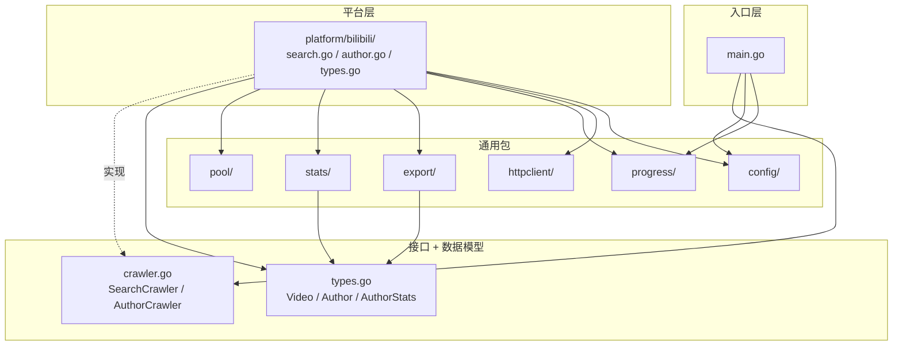

# Feature: Bilibili 爬虫（阶段 0 + 阶段 1）

**作者**: User  
**日期**: 2026-03-26  
**状态**: Draft

---

## 1. 背景 (Background)

### 1.1 问题描述

在网红-品牌营销场景中，需要一个工具来爬取视频平台的元数据，用于：
- **统计数据**：根据关键字搜索视频，统计视频的标题、作者、播放次数、发布时间、视频时长、来源等元数据
- **筛选博主**：根据搜索结果聚合博主信息，获取博主的粉丝数、视频数据等，便于后续用 Excel 筛选

此前使用 Python + Selenium 实现了 YouTube 爬虫（`doc/youtube.py`），但存在以下问题：
- Python 部署依赖多，性能有限
- 代码仅支持 YouTube 单平台，无法扩展
- 缺乏博主维度的数据聚合能力

### 1.2 现状分析

- 这是一个全新的 Go 项目，尚无代码实现
- 已有参考实现 `doc/youtube.py`：使用 Selenium 打开 YouTube 搜索页 → 滚动到底 → 解析 HTML 中的 `aria-label` 提取视频元数据 → 输出 CSV
- Bilibili 有较完善的社区 API 文档（[bilibili-API-collect](https://github.com/SocialSisterYi/bilibili-API-collect)），搜索、视频详情、用户信息等接口可用，无需浏览器自动化
- 技术方案已确认：Go 语言 + 分梯度混合爬虫策略（Bilibili 使用 API 直调）

### 1.3 主要使用场景

1. **场景 A：视频数据统计**  
   用户输入关键字（如"美妆测评"），工具搜索 Bilibili 视频，汇总所有搜索结果的元数据，输出 CSV 文件供分析

2. **场景 B：博主信息聚合**  
   在场景 A 的基础上，对搜索结果按作者聚合，逐个获取博主的详细信息（粉丝数、视频统计、地区、语言等），输出博主维度的 CSV 文件

## 2. 目标 (Goals)

### 阶段 0：关键字搜索 + 视频元数据统计
- 用 Go 重写 `youtube.py` 的核心能力，但目标平台为 **Bilibili**
- 输入关键字，搜索 Bilibili 视频，提取元数据，输出 CSV
- **完成标准**：跑通 Bilibili 单平台即可

### 阶段 1：搜索结果中的博主聚合
- 在阶段 0 的基础上，对搜索结果按作者聚合
- 逐个获取博主主页信息，输出博主维度的 CSV
- 博主字段：博主名字、粉丝数、视频数量、视频平均播放量、视频平均时长、视频平均评论数、视频平均点赞量、地区、语言、播放最多的 3 个视频名+视频链接
- **完成标准**：能输出包含上述字段的博主 CSV 文件

### 代码质量目标
- 做好代码抽象（统一 Crawler 接口），便于后续添加新平台
- 优先 Windows 开发，但保持跨平台兼容

### 2.1 非目标 (Non-Goals)
- ❌ 本期不做 YouTube、Instagram 等其他平台
- ❌ 本期不做博主筛选功能（有了 CSV，用 Excel 即可筛选）
- ❌ 本期不建博主数据库
- ❌ 本期不做定时爬取/增量更新
- ❌ 本期不做反爬对抗（代理 IP 池等）
- ❌ 本期不做 Web UI

## 3. 需求细化 (Requirements)

### 3.1 功能性需求

#### FR-1：阶段 0 — 关键字搜索 + 视频元数据采集

| 项目 | 说明 |
|------|------|
| **输入** | 命令行参数：`--platform bilibili --keyword "关键词"` |
| **处理** | 调用 Bilibili 搜索 API，按页码翻页采集视频元数据 |
| **输出** | 视频维度 CSV 文件（每行一个视频） |
| **搜索翻页上限** | 可配置（`config.yaml`），默认最大 **50 页** |

**阶段 0 输出字段**：

| 字段 | 说明 |
|------|------|
| 标题 | 视频标题 |
| 作者 | UP 主名称 |
| 播放次数 | 视频播放量 |
| 发布时间 | 视频发布时间 |
| 视频时长(s) | 视频时长，单位秒 |
| 来源 | 固定值 "bilibili" |

#### FR-2：阶段 1 — 博主信息聚合

| 项目 | 说明 |
|------|------|
| **输入** | 阶段 0 的搜索结果（按作者去重聚合） |
| **处理** | 逐个进入博主主页，基于博主的**所有视频**计算统计数据 |
| **输出** | 博主维度 CSV 文件（每行一个博主），与阶段 0 的 CSV **独立输出** |
| **博主视频采集上限** | 可配置（`config.yaml`），默认最大 **1000 个视频** |

**阶段 1 输出字段**：

| 字段 | 说明 |
|------|------|
| 博主名字 | UP 主昵称 |
| 粉丝数 | 博主粉丝数 |
| 视频数量 | 博主投稿视频总数 |
| 视频平均播放量 | 基于采集到的所有视频计算 |
| 视频平均时长 | 基于采集到的所有视频计算，单位秒 |
| 视频平均评论数 | 基于采集到的所有视频计算 |
| 视频平均点赞量 | 基于采集到的所有视频计算 |
| 地区 | 尽量精确（国家 > 省 > 市），取 API 返回的最精确值 |
| 语言 | 基于视频标题的字符集检测，判断最大概率出现的文字类型 |
| 视频_TOP1 | 播放量最高的视频，使用 Excel `HYPERLINK` 公式（显示视频名，点击跳转链接） |
| 视频_TOP2 | 播放量第二的视频，同上 |
| 视频_TOP3 | 播放量第三的视频，同上 |

#### FR-3：命令行参数与配置文件

**命令行参数**（运行时指定）：

| 参数 | 说明 | 示例 |
|------|------|------|
| `--platform` | 目标平台 | `bilibili` |
| `--keyword` | 搜索关键词 | `"美妆测评"` |

**配置文件**（`config.yaml`，内部参数）：

| 参数 | 说明 | 默认值 |
|------|------|--------|
| `max_search_page` | 搜索最大翻页数 | 50 |
| `max_video_per_author` | 每个博主最大采集视频数 | 1000 |
| `concurrency` | 并发度 | 4 |
| `output_dir` | CSV 输出目录 | `data/` |

#### FR-4：CSV 输出规范

- **输出目录**：由配置文件指定，默认 `data/`
- **文件命名**：`{平台}_{关键词}_{日期}_{时间}.csv`，如 `bilibili_美妆_20260326_210430.csv`
- **阶段 0 和阶段 1 各自独立输出** CSV 文件
- **TOP 视频列**：使用 Excel `=HYPERLINK("url", "视频名")` 公式，在 Excel 中显示为可点击超链接

### 3.2 非功能性需求

#### NFR-1：断点续爬

- 在输出目录下维护进度文件 `progress_<任务hash>.json`，记录：
  - 任务参数（平台、关键词，用于校验是否同一任务）
  - 当前阶段（阶段 0 搜索 / 阶段 1 详情采集）
  - 阶段 0 进度：已爬到第几页、已收集到的博主 mid 列表
  - 阶段 1 进度：已完成采集的博主 mid 集合
  - 最后更新时间
- 程序启动时检测未完成的进度文件，提示用户选择继续或重新开始
- 每完成一个博主的详情采集后更新进度文件（博主级粒度）
- 任务全部完成后自动删除进度文件

#### NFR-2：并发控制

- 并发度可配置（`config.yaml`），默认 **4**
- **阶段 0**：多个 goroutine 并发请求不同页码（纯 HTTP 并发）
- **阶段 1**：多个 goroutine 并发处理不同博主的详情采集（博主级并发）
- 浏览器自动化仅作为兜底降级方案，阶段 0/1 优先使用纯 HTTP API

#### NFR-3：错误处理

- 单次 HTTP 请求失败自动重试 3 次
- 全部重试失败则跳过该条目，记录错误日志
- 任务结束后汇总报告失败条目

#### NFR-4：可扩展性

- 统一 Crawler 接口抽象，便于后续添加新平台（YouTube、Instagram 等）
- 优先 Windows 开发，保持跨平台兼容

## 4. 设计方案 (Design)

> 由 workflow-system-design 负责填写

### 4.1 方案概览

#### 整体思路

采用**分层架构 + 平台隔离**的设计：通用逻辑（并发、统计、断点续爬、导出）作为独立子包平铺在 `src/` 下，平台相关的爬虫逻辑放在 `src/platform/bilibili/` 下。两个阶段（搜索采集 + 博主详情）是独立可组合的执行单元，通过中间数据文件解耦。

#### 模块划分

| 层级 | 模块 | 职责 |
|------|------|------|
| **入口层** | `main` / CLI | 命令行解析、配置加载、阶段调度 |
| **平台层** | `src/platform/bilibili/` | Bilibili 搜索 API 调用、博主详情 API 调用、响应解析 |
| **通用层** | `src/pool/`, `src/stats/`, `src/export/`, `src/progress/`, `src/httpclient/`, `src/config/` | Worker Pool 并发、数据统计计算、CSV 导出、断点续爬、HTTP 客户端+重试、配置加载 |

#### 依赖方向

**单向依赖**：`platform/bilibili/` → 各通用包（平台层依赖通用层，通用包之间互不依赖，通用包不依赖任何平台）

#### 数据流

```
用户输入(CLI)
  → 加载配置(config.yaml)
  → 阶段0: 搜索API翻页采集 → 视频CSV + 中间数据文件(去重博主mid列表)
  → 阶段1: 读取中间数据 → Worker Pool并发采集博主详情 → 统计计算 → 博主CSV
```

#### 运行模式

- `--stage 0`：只跑阶段 0
- `--stage 1`：只跑阶段 1（需要中间数据文件已存在）
- `--stage all`（默认）：阶段 0 + 阶段 1 串行执行

#### 关键 Trade-off

| 决策 | 收益 | 代价 |
|------|------|------|
| 中间数据文件解耦阶段 0/1 | 阶段可独立运行、断点续爬简洁 | 引入磁盘 I/O |
| 通用逻辑拆分为独立子包平铺 `src/` 下 | 各包职责单一、互不耦合、后续新平台可复用 | 包数量较多，需注意命名清晰 |
| Worker Pool 并发模型 | 任务均匀分配，避免木桶效应 | 实现复杂度略高于简单 goroutine |

### 4.2 组件设计 (Component Design)
#### 4.2.1 核心类/模块设计

##### 目录结构

```
src/
├── main.go                    # 入口：CLI 解析、配置加载、进度检测、阶段调度
├── crawler.go                 # 流程框架接口（SearchCrawler + AuthorCrawler）
├── types.go                   # 通用数据模型（Video、Author 等平台无关结构体）
├── pool/                      # Worker Pool 并发
│   └── pool.go
├── stats/                     # 数据统计计算（平均值、TOP N 等）
│   └── stats.go
├── export/                    # CSV 导出（含 HYPERLINK 公式生成）
│   └── export.go
├── progress/                  # 断点续爬（进度文件 JSON 读写）
│   └── progress.go
├── httpclient/                # HTTP 客户端 + 指数退避重试
│   └── client.go
├── config/                    # 配置加载（config.yaml 解析，全局对象）
│   └── config.go
└── platform/
    └── bilibili/              # Bilibili 平台实现（不分包，按功能拆文件）
        ├── search.go          # 阶段 0：搜索 API 调用
        ├── author.go          # 阶段 1：博主详情 API 调用
        └── types.go           # Bilibili API 响应结构体
```

##### 各模块职责

| 模块 | 职责 | 关键类型/函数 |
|------|------|-------------|
| `main.go` | CLI 参数解析 → 加载配置 → 检测进度文件 → 调度阶段执行 | `main()` |
| `crawler.go` | 定义两个流程框架接口 | `SearchCrawler`, `AuthorCrawler` |
| `types.go` | 平台无关的通用数据模型 | `Video`, `Author`, `AuthorStats`, `TopVideo` |
| `pool/` | Worker Pool：channel + N goroutine 消费，谁做完谁取下一个 | `Pool`, `Task`, `Run()` |
| `stats/` | 数据统计：平均播放量、平均时长、TOP N 等 | `CalcAuthorStats()` |
| `export/` | CSV 导出：含 Excel HYPERLINK 公式生成 | `WriteVideoCSV()`, `WriteAuthorCSV()` |
| `progress/` | 进度文件 JSON 读写，博主级粒度 | `Progress`, `Load()`, `Save()`, `MarkDone()` |
| `httpclient/` | HTTP 客户端封装 + 指数退避重试（最多 3 次） | `Client`, `Get()` |
| `config/` | config.yaml 解析，通过 `Get()` 函数暴露全局配置对象 | `Config`, `Load()`, `Get()` |
| `platform/bilibili/search.go` | 实现 `SearchCrawler` 接口，调用 Bilibili 搜索 API | `BiliSearchCrawler` |
| `platform/bilibili/author.go` | 实现 `AuthorCrawler` 接口，调用博主详情/视频列表 API | `BiliAuthorCrawler` |
| `platform/bilibili/types.go` | Bilibili API 响应结构体（搜索、用户信息、投稿视频等） | `SearchResp`, `UserInfoResp`, `VideoListResp` |

##### 依赖关系



**依赖方向**：单向。`platform/bilibili/` → 通用包 + 接口层。通用包之间互不依赖（`stats/` 和 `export/` 仅依赖 `types.go` 中的数据模型）。

##### 关键设计决策

| 决策 | 理由 |
|------|------|
| 通用包平铺在 `src/` 下，不套 `comm/` | 各包之间无耦合，平铺更清晰 |
| 两个独立接口（`SearchCrawler` + `AuthorCrawler`）而非一个大接口 | 接口隔离原则，阶段 0/1 可独立运行 |
| `Author` 统计字段拆分为 `AuthorStats` 嵌入 | `stats/` 包负责计算统计值，职责边界更清晰 |
| 全局配置通过 `config.Get()` 函数暴露 | 运行中不修改，全局对象更简单；函数封装后续可加锁或延迟加载 |
| 重试逻辑合并到 `httpclient/` | 重试本质是 HTTP 客户端的行为，不需要单独成包 |
| 流程框架接口放 `src/crawler.go` | 不建独立包，减少包层级；后续新平台实现同一接口即可 |

#### 4.2.2 接口设计

##### 辅助类型

```go
// PageInfo carries pagination metadata returned by API responses.
// Avoids a separate TotalPages() method — the first SearchPage/FetchAuthorVideos
// call naturally returns this info as part of the response.
type PageInfo struct {
    TotalPages int // total pages available
    TotalCount int // total items available
}

// AuthorMid represents a unique author identifier, passed from stage 0 to stage 1.
type AuthorMid struct {
    Name string // author display name (for logging/progress)
    ID   string // platform-specific user ID (e.g. Bilibili mid)
}
```

##### SearchCrawler 接口（阶段 0）

```go
// SearchCrawler defines the platform-specific search capability.
// Each platform implements this interface to provide keyword-based video search.
type SearchCrawler interface {
    // SearchPage fetches a single page of search results for the given keyword.
    // Returns the videos found on that page and pagination info.
    // The caller uses PageInfo.TotalPages (from the first call) to decide how many
    // pages to fetch in total (capped by config.max_search_page).
    SearchPage(ctx context.Context, keyword string, page int) ([]Video, PageInfo, error)
}
```

**调用方式**（编排函数 `RunStage0` 内部）：

```
1. SearchPage(keyword, page=1) → 获取第一页视频 + PageInfo.TotalPages
2. 确定实际翻页数 = min(TotalPages, config.max_search_page)
3. Worker Pool 并发调用 SearchPage(keyword, page=2..N)
4. 汇总所有视频 → 按 AuthorMid 去重 → 写视频 CSV + 中间数据文件
```

##### AuthorCrawler 接口（阶段 1）

```go
// AuthorCrawler defines the platform-specific author detail capability.
// Each platform implements this interface to provide author info and video list fetching.
type AuthorCrawler interface {
    // FetchAuthorInfo fetches basic author info (name, followers, region, etc.).
    FetchAuthorInfo(ctx context.Context, mid string) (*AuthorInfo, error)

    // FetchAuthorVideos fetches a single page of the author's video list.
    // Returns video details and pagination info.
    // The caller uses PageInfo.TotalPages (from the first call) to decide how many
    // pages to fetch (capped by config.max_video_per_author / page_size).
    FetchAuthorVideos(ctx context.Context, mid string, page int) ([]VideoDetail, PageInfo, error)
}
```

**调用方式**（编排函数 `RunStage1` 内部）：

```
对每个博主（Worker Pool 并发，博主级并发）：
  1. FetchAuthorInfo(mid) → 获取基本信息（粉丝数、地区等）
  2. FetchAuthorVideos(mid, page=1) → 获取第一页视频 + PageInfo.TotalPages
  3. 确定实际翻页数 = min(TotalPages, ceil(config.max_video_per_author / page_size))
  4. 顺序翻页 FetchAuthorVideos(mid, page=2..N)，汇总所有视频
  5. 调用 stats.CalcAuthorStats(videos) → 计算统计值 + TOP 3
  6. 组装 Author 结构体
全部博主完成后 → 写博主 CSV
```

##### 编排函数（`crawler.go`）

```go
// RunStage0 orchestrates stage 0: search → paginate → collect → deduplicate → export CSV.
// Internally calls SearchCrawler.SearchPage via Worker Pool, writes video CSV and
// intermediate data file (deduplicated AuthorMid list).
// Returns the AuthorMid list for stage 1 consumption.
func RunStage0(ctx context.Context, sc SearchCrawler, keyword string) ([]AuthorMid, error)

// RunStage1 orchestrates stage 1: iterate authors → fetch details → calc stats → export CSV.
// Internally uses Worker Pool for author-level concurrency.
// For each author: FetchAuthorInfo + FetchAuthorVideos (paginated) → stats.CalcAuthorStats → Author.
// Writes author CSV after all authors are processed.
func RunStage1(ctx context.Context, ac AuthorCrawler, mids []AuthorMid) error
```

##### 接口与实现的映射

| 接口 | Bilibili 实现 | 所在文件 |
|------|-------------|---------|
| `SearchCrawler` | `BiliSearchCrawler` | `platform/bilibili/search.go` |
| `AuthorCrawler` | `BiliAuthorCrawler` | `platform/bilibili/author.go` |

##### 关键设计决策

| 决策 | 理由 |
|------|------|
| `SearchPage` 返回 `PageInfo` 而非单独 `TotalPages()` 方法 | Bilibili 搜索 API 的总页数在搜索响应中返回，不是独立接口；避免多一次冗余请求 |
| `FetchAuthorVideos` 同样返回 `PageInfo` | 与 `SearchPage` 保持一致的分页模式 |
| `FetchAuthorInfo` 和 `FetchAuthorVideos` 拆分为两个方法 | 对应两个独立的 API 调用，职责清晰；且 `FetchAuthorInfo` 只需调一次，`FetchAuthorVideos` 需要翻页 |
| 统计计算在编排层（`RunStage1`）完成，不在 `AuthorCrawler` 内部 | `AuthorCrawler` 只负责数据获取，统计是通用逻辑（`stats/` 包），职责分离 |
| 编排函数是具体函数而非接口 | 流程骨架（搜索→翻页→汇总→导出）是固定的，不需要多态；平台差异通过接口参数注入 |

#### 4.2.3 数据模型

所有通用数据模型统一放在 `src/types.go`，接口辅助类型（`PageInfo`、`AuthorMid`）放在 `src/crawler.go`。

##### 类型总览

| 类型 | 所在文件 | 用途 |
|------|---------|------|
| `Video` | `types.go` | 阶段 0 搜索结果，直接输出视频 CSV |
| `VideoDetail` | `types.go` | 阶段 1 博主视频详情，用于统计计算 |
| `AuthorInfo` | `types.go` | 博主基本信息（API 原始数据） |
| `Author` | `types.go` | 阶段 1 最终输出，包含基本信息 + 统计值 + TOP 视频 |
| `AuthorStats` | `types.go` | 博主统计值，嵌入 `Author` |
| `TopVideo` | `types.go` | TOP N 视频，嵌入 `Author` |
| `PageInfo` | `crawler.go` | 分页元数据，接口返回值的一部分 |
| `AuthorMid` | `crawler.go` | 博主标识，阶段 0 → 阶段 1 的传递载体 |

##### `types.go` 完整定义

```go
// ==================== 阶段 0：搜索结果 ====================

// Video represents a single video from search results (stage 0 output).
// Fields are limited to what the search API returns.
type Video struct {
    Title     string    // video title
    Author    string    // author display name
    AuthorID  string    // platform-specific author ID (e.g. Bilibili mid)
    PlayCount int64     // view/play count
    PubDate   time.Time // publish date
    Duration  int       // duration in seconds
    Source    string    // platform name, e.g. "bilibili"
}

// ==================== 阶段 1：博主详情 ====================

// AuthorInfo holds basic author profile data returned by the author info API.
// This is raw API data before any stats calculation.
type AuthorInfo struct {
    Name      string // author display name
    Followers int64  // follower count
    Region    string // location (country > province > city, best effort)
}

// VideoDetail holds detailed video data returned by the author's video list API.
// Contains more fields than Video (comments, likes) needed for stats calculation.
type VideoDetail struct {
    Title        string    // video title
    BvID         string    // Bilibili video ID (for URL generation)
    PlayCount    int64     // view/play count
    CommentCount int64     // comment count
    LikeCount    int64     // like count
    Duration     int       // duration in seconds
    PubDate      time.Time // publish date
}

// AuthorStats holds computed statistics for an author's videos.
// Calculated by stats.CalcAuthorStats() from []VideoDetail.
type AuthorStats struct {
    AvgPlayCount    float64 // average play count across all videos
    AvgDuration     float64 // average duration in seconds
    AvgCommentCount float64 // average comment count
    AvgLikeCount    float64 // average like count
}

// TopVideo represents a top-performing video (for CSV HYPERLINK output).
type TopVideo struct {
    Title     string // video title
    URL       string // full video URL
    PlayCount int64  // play count (used for sorting)
}

// Author represents a content creator with aggregated stats (stage 1 output).
// Assembled in RunStage1 from AuthorInfo + stats.CalcAuthorStats() results.
type Author struct {
    Name       string      // author display name
    ID         string      // platform-specific author ID
    Followers  int64       // follower count
    Region     string      // location
    Language   string      // detected language (charset detection on video titles)
    VideoCount int         // total video count (from API metadata, not len(videos))
    Stats      AuthorStats // aggregated statistics (embedded)
    TopVideos  []TopVideo  // top 3 videos by play count
}
```

##### `crawler.go` 辅助类型

```go
// PageInfo carries pagination metadata returned by API responses.
type PageInfo struct {
    TotalPages int // total pages available
    TotalCount int // total items available (e.g. total videos)
}

// AuthorMid represents a unique author identifier, passed from stage 0 to stage 1.
// Also used as the intermediate data file format.
type AuthorMid struct {
    Name string // author display name (for logging/progress)
    ID   string // platform-specific user ID (e.g. Bilibili mid)
}
```

##### `Video` vs `VideoDetail` 不合并的理由

| 维度 | `Video` | `VideoDetail` |
|------|---------|--------------|
| 数据来源 | 搜索 API（`/x/web-interface/search/type`） | 用户投稿视频 API（`/x/space/wbi/arc/search`） |
| 用途 | 直接输出阶段 0 视频 CSV | 用于 `stats.CalcAuthorStats()` 统计计算 |
| 字段差异 | 无评论数、点赞数 | 包含评论数、点赞数、BvID |
| 合并代价 | 阶段 0 会有大量空字段，语义不清晰 | — |

##### 数据流转关系

```
阶段 0:
  SearchPage() → []Video → export.WriteVideoCSV()
                         → 提取去重 → []AuthorMid → 中间数据文件

阶段 1:
  FetchAuthorInfo()   → AuthorInfo ─┐
  FetchAuthorVideos() → []VideoDetail → stats.CalcAuthorStats() → AuthorStats
                                     → stats.TopN() → []TopVideo
                                       ↓
                              组装 → Author → export.WriteAuthorCSV()
```

#### 4.2.4 并发模型

##### Worker Pool 设计

采用泛型 Worker Pool，基于 channel + N goroutine 消费模型（谁做完谁取下一个）。

```go
// TaskResult wraps a single task's outcome: either a result or an error.
// Preserves the original task for retry/logging purposes.
type TaskResult[T any, R any] struct {
    Task   T     // original task input (preserved for retry/error reporting)
    Result R     // result on success
    Err    error // non-nil on failure
}

// Run starts N workers, each consuming tasks from an internal channel.
// Returns after all tasks are processed or ctx is cancelled.
// Every task produces a TaskResult — the caller inspects Err to separate
// successes from failures. Failed tasks retain the original Task for retry.
func Run[T any, R any](
    ctx         context.Context,
    concurrency int,
    tasks       []T,
    worker      func(ctx context.Context, task T) (R, error),
) []TaskResult[T, R]
```

**设计要点**：

| 要点 | 说明 |
|------|------|
| 泛型 `T`/`R` | 调用方无需类型断言，编译期类型安全 |
| `TaskResult` 保留原始 `Task` | 失败时可直接拿到失败的任务输入，用于日志记录和后续重试 |
| 返回 `[]TaskResult` 而非 `([]R, []error)` | 成功/失败结果与原始任务一一对应，不会丢失关联关系 |
| 单个任务失败不阻塞其他任务 | Worker 捕获 error 后继续消费下一个任务 |
| `ctx` 取消时所有 Worker 退出 | 支持优雅终止（如 Ctrl+C） |

##### 阶段 0 并发策略

```
RunStage0:
  1. 串行调用 SearchPage(keyword, page=1)
     → 获取第一页 []Video + PageInfo.TotalPages
  2. 计算实际翻页数 = min(TotalPages, config.max_search_page)
  3. 构造任务列表: tasks = [page=2, page=3, ..., page=N]
  4. pool.Run(concurrency, tasks, SearchPage) → []TaskResult
     ┌─ Worker 1: SearchPage(keyword, page=2)
     ├─ Worker 2: SearchPage(keyword, page=3)
     ├─ Worker 3: SearchPage(keyword, page=4)
     └─ Worker 4: SearchPage(keyword, page=5)
              ... 谁做完谁取下一个 ...
  5. 汇总所有成功的 []Video + 第一页的 []Video
  6. 记录失败的页码（从 TaskResult.Task 获取）到日志
  7. 按 AuthorID 去重 → 写视频 CSV + 中间数据文件
```

##### 阶段 1 并发策略

```
RunStage1:
  1. 构造任务列表: tasks = []AuthorMid (从中间数据文件读取)
  2. pool.Run(concurrency, tasks, processOneAuthor) → []TaskResult
     ┌─ Worker 1: processOneAuthor(博主A)
     ├─ Worker 2: processOneAuthor(博主B)
     ├─ Worker 3: processOneAuthor(博主C)
     └─ Worker 4: processOneAuthor(博主D)
              ... 谁做完谁取下一个 ...
  3. 汇总所有成功的 Author
  4. 记录失败的博主（从 TaskResult.Task 获取 AuthorMid）到日志
  5. 写博主 CSV

processOneAuthor(mid) 内部（串行）：
  1. FetchAuthorInfo(mid) → AuthorInfo
  2. FetchAuthorVideos(mid, page=1) → 第一页 []VideoDetail + PageInfo
  3. 计算翻页数 = min(TotalPages, ceil(max_video_per_author / page_size))
  4. 串行翻页 FetchAuthorVideos(mid, page=2..N)，汇总所有 []VideoDetail
  5. stats.CalcAuthorStats(videos) → AuthorStats + []TopVideo
  6. 组装 Author 结构体并返回
```

**阶段 1 博主内部串行的理由**：单个博主最多约 1000 条视频（~50 页），串行翻页耗时可接受；避免对同一用户 API 并发过多触发限流。

##### 并发度配置

| 参数 | 来源 | 默认值 | 说明 |
|------|------|--------|------|
| `concurrency` | `config.yaml` | 4 | 阶段 0 和阶段 1 共用同一并发度配置 |

##### 错误记录与重试

Worker Pool 本身**不做自动重试**（HTTP 层面的重试由 `httpclient/` 负责）。Pool 层面的职责是：

1. **记录失败任务**：`TaskResult.Err != nil` 时，`TaskResult.Task` 保留了原始任务输入（页码 / AuthorMid）
2. **编排层汇总失败**：`RunStage0` / `RunStage1` 遍历 `[]TaskResult`，收集所有失败条目
3. **日志输出**：任务结束后打印失败汇总（失败数量 + 具体条目）
4. **断点续爬兜底**：阶段 1 中，已成功的博主会写入进度文件；下次运行时跳过已完成的博主，自然实现"重试失败博主"

```
错误处理层次：
  HTTP 请求失败 → httpclient 自动重试 3 次（指数退避）
  重试仍失败   → 返回 error 给 Worker
  Worker        → 包装为 TaskResult{Task, Err} 返回给 Pool
  Pool          → 收集所有 TaskResult 返回给编排函数
  编排函数      → 汇总失败条目，打印日志，继续处理成功的结果
  断点续爬      → 下次运行时，未完成的博主自动重试
```

#### 4.2.5 错误处理

##### 三层错误处理架构

```
┌─────────────────────────────────────────────────────┐
│ 第 1 层：HTTP 客户端层（httpclient/）                  │
│   单次请求失败 → 指数退避重试（最多 N 次）               │
│   全部重试失败 → 返回 error（包含请求上下文信息）         │
├─────────────────────────────────────────────────────┤
│ 第 2 层：Worker Pool 层（pool/）                      │
│   Worker 执行失败 → 包装为 TaskResult{Task, Err}       │
│   不阻塞其他 Worker，继续消费下一个任务                  │
│   连续失败计数 → 达到熔断阈值时取消整个任务               │
├─────────────────────────────────────────────────────┤
│ 第 3 层：编排层（crawler.go RunStage0/RunStage1）      │
│   遍历 []TaskResult → 分离成功/失败                    │
│   成功结果正常处理 → 失败条目汇总报告                    │
│   阶段 1 已成功的博主写入进度文件（断点续爬兜底）          │
└─────────────────────────────────────────────────────┘
```

##### 第 1 层：httpclient 重试策略

```go
// RetryConfig for httpclient (all values from config.yaml)
type RetryConfig struct {
    MaxRetries    int           // max retry attempts, default 3
    InitialDelay  time.Duration // first retry delay, default 1s
    MaxDelay      time.Duration // max retry delay cap, default 10s
    BackoffFactor float64       // multiplier per retry, default 2.0
}
// Retry sequence example: 1s → 2s → 4s (capped at 10s)
```

**重试判定规则**：

| HTTP 状态 | 是否重试 | 理由 |
|-----------|---------|------|
| 网络超时 / 连接错误 | ✅ 重试 | 临时性网络问题 |
| 5xx | ✅ 重试 | 服务端临时错误 |
| 429 (Too Many Requests) | ✅ 重试 | 限流，退避后可能恢复 |
| 412 (Precondition Failed) | ✅ 重试 | Bilibili 反爬响应，退避后可能恢复 |
| 4xx（除 429/412） | ❌ 不重试 | 客户端错误，重试无意义 |

> **实践经验**：Bilibili 在检测到异常请求时会返回 HTTP 412，这不是标准的客户端错误，而是反爬机制的一种表现。将其归类为可重试错误后，配合指数退避，大部分请求最终能成功。详见 [反爬调试笔记](./bilibili-anti-crawl-notes.md)。

每次重试时输出 WARN 日志，包含：URL、状态码、第几次重试、下次等待时间。

##### 第 2 层：Worker Pool 连续失败熔断

当 Worker Pool 中**连续**多个任务失败（未穿插任何成功），判定为系统性故障（如 API 被封禁、网络中断），触发熔断，取消整个任务。

```go
// 熔断逻辑（在 pool.Run 内部实现）
consecutiveFailures := 0
for result := range results {
    if result.Err != nil {
        consecutiveFailures++
        if consecutiveFailures >= config.max_consecutive_failures {
            cancel() // 取消 ctx，所有 Worker 退出
            log.Printf("FATAL: %d consecutive failures, aborting", consecutiveFailures)
            break
        }
    } else {
        consecutiveFailures = 0 // 成功一次就重置计数
    }
}
```

**熔断配置**：

| 参数 | 来源 | 默认值 | 说明 |
|------|------|--------|------|
| `max_consecutive_failures` | `config.yaml` | 3 | 连续失败达到此值时终止整个任务 |

**熔断 vs 跳过的区别**：

| 场景 | 行为 |
|------|------|
| 偶发失败（如某个博主的 API 返回 500） | 跳过该任务，继续处理其他任务 |
| 连续 N 次失败（如 IP 被封、API 全面不可用） | 熔断，终止整个阶段，保存已有进度 |

##### 第 3 层：编排层错误汇总

任务结束后（无论正常完成还是熔断终止），编排函数打印汇总报告：

```
[Stage 0] 完成: 成功 48/50 页, 失败 2 页 (page=17, page=33)
[Stage 1] 完成: 成功 95/100 博主, 失败 5 博主 (mid=12345, mid=67890, ...)
```

熔断终止时额外输出：

```
[Stage 1] 熔断终止: 连续 3 次失败，已处理 42/100 博主，进度已保存
```

##### 日志方案

使用 Go 标准库 `log` 包，不引入第三方日志库。

**日志级别约定**（通过前缀区分）：

| 前缀 | 用途 | 示例 |
|------|------|------|
| `INFO:` | 正常流程节点 | `INFO: Stage 0 started, keyword="美妆"` |
| `WARN:` | 可恢复的异常 | `WARN: HTTP retry 2/3, url=..., status=500, next_wait=2s` |
| `ERROR:` | 不可恢复的单条失败 | `ERROR: Failed to fetch author mid=12345: context deadline exceeded` |
| `FATAL:` | 熔断/致命错误 | `FATAL: 3 consecutive failures, aborting stage 1` |

##### 错误处理完整流程

```
HTTP 请求发出
  ├─ 成功 → 返回响应
  └─ 失败 → httpclient 判断是否可重试
              ├─ 可重试 → 指数退避重试（最多 3 次）
              │            ├─ 某次成功 → 返回响应
              │            └─ 全部失败 → 返回 error
              └─ 不可重试 → 直接返回 error
                              ↓
                    Worker 收到 error
                      → 包装为 TaskResult{Task, Err}
                      → Pool 收集结果
                        → 检查连续失败计数
                          ├─ < 阈值 → 继续处理下一个任务
                          └─ >= 阈值 → 熔断，cancel ctx
                              ↓
                    编排函数收到 []TaskResult
                      → 分离成功/失败
                      → 成功结果 → 正常处理（写 CSV 等）
                      → 失败条目 → 打印汇总日志
                      → 更新进度文件（已完成的部分）
```

### 4.3 核心逻辑实现

#### 4.3.1 stats 统计计算

##### 函数签名

```go
// CalcAuthorStats computes aggregated statistics and top-N videos from a list of video details.
// topN specifies how many top videos to return (sorted by play count descending).
// Returns zero-value AuthorStats and nil TopVideos if videos is empty.
func CalcAuthorStats(videos []VideoDetail, topN int) (AuthorStats, []TopVideo)
```

##### 计算逻辑

```
输入: []VideoDetail (博主的所有视频), topN (默认 3)

1. 边界检查: len(videos) == 0 → 返回零值
2. 遍历 videos，累加:
   - totalPlay     += video.PlayCount
   - totalDuration += video.Duration
   - totalComment  += video.CommentCount
   - totalLike     += video.LikeCount
3. 计算平均值:
   - AvgPlayCount    = float64(totalPlay) / float64(len(videos))
   - AvgDuration     = float64(totalDuration) / float64(len(videos))
   - AvgCommentCount = float64(totalComment) / float64(len(videos))
   - AvgLikeCount    = float64(totalLike) / float64(len(videos))
4. 排序取 TOP N:
   - 按 PlayCount 降序排序（使用 slices.SortFunc，不修改原切片）
   - 取前 min(topN, len(videos)) 个
   - 转换为 []TopVideo（填充 Title、URL、PlayCount）
5. 返回 (AuthorStats, []TopVideo)
```

**URL 生成规则**：`https://www.bilibili.com/video/{BvID}`

##### 注意事项

- 统计基于**实际采集到的视频**（受 `max_video_per_author` 配置限制），而非博主的全部视频
- `Author.VideoCount` 来自 API 返回的元数据（博主实际投稿总数），与统计样本数可能不同
- 排序前先拷贝切片，避免修改调用方的原始数据

#### 4.3.2 语言检测

##### 方案

使用 **[lingua-go](https://github.com/pemistahl/lingua-go)** 库进行语言检测，不做字符集快速路径，所有语言统一走 lingua-go 模型检测。

##### 选择 lingua-go 的理由

| 维度 | 说明 |
|------|------|
| 短文本精度 | 专为短文本优化，视频标题（10-30 字）场景下精度最高 |
| 语言覆盖 | 支持 75 种语言，覆盖全球主流语言（中/日/韩/英/德/西/法/葡/俄/阿拉伯等） |
| 可配候选语言 | 可限定候选语言列表，提升精度和速度 |
| 维护活跃 | GitHub ~1.1k star，持续维护 |

##### 检测逻辑

```go
// DetectLanguage detects the dominant language from a list of video titles.
// Concatenates all titles into a single text, then uses lingua-go for detection.
// Returns ISO 639-1 language code (e.g. "zh", "en", "ja", "de") or "unknown".
func DetectLanguage(titles []string) string
```

```
输入: []string (博主所有视频的标题列表)

1. 边界检查: len(titles) == 0 → 返回 "unknown"
2. 拼接所有标题: text = strings.Join(titles, " ")
3. 调用 lingua-go 检测:
   lang, exists := detector.DetectLanguageOf(text)
4. exists == false → 返回 "unknown"
5. 返回 lang 对应的 ISO 639-1 代码
```

##### lingua-go Detector 初始化

Detector 是**线程安全**的，全局初始化一次，所有 Worker 共享。

```go
// 在 stats 包的 init() 或显式初始化函数中创建
var detector lingua.LanguageDetector

func InitDetector() {
    languages := []lingua.Language{
        lingua.Chinese, lingua.Japanese, lingua.Korean,
        lingua.English, lingua.German, lingua.Spanish,
        lingua.French, lingua.Portuguese, lingua.Russian,
        lingua.Arabic, lingua.Thai, lingua.Vietnamese,
        lingua.Italian, lingua.Dutch, lingua.Turkish,
        lingua.Indonesian, lingua.Hindi,
    }
    detector = lingua.NewLanguageDetectorBuilder().
        FromLanguages(languages...).
        WithMinimumRelativeDistance(0.25).
        Build()
}
```

**候选语言列表**（17 种，覆盖全球主流市场）：

| 语言 | lingua 常量 | ISO 639-1 |
|------|------------|-----------|
| 中文 | `lingua.Chinese` | zh |
| 日语 | `lingua.Japanese` | ja |
| 韩语 | `lingua.Korean` | ko |
| 英语 | `lingua.English` | en |
| 德语 | `lingua.German` | de |
| 西班牙语 | `lingua.Spanish` | es |
| 法语 | `lingua.French` | fr |
| 葡萄牙语 | `lingua.Portuguese` | pt |
| 俄语 | `lingua.Russian` | ru |
| 阿拉伯语 | `lingua.Arabic` | ar |
| 泰语 | `lingua.Thai` | th |
| 越南语 | `lingua.Vietnamese` | vi |
| 意大利语 | `lingua.Italian` | it |
| 荷兰语 | `lingua.Dutch` | nl |
| 土耳其语 | `lingua.Turkish` | tr |
| 印尼语 | `lingua.Indonesian` | id |
| 印地语 | `lingua.Hindi` | hi |

##### 设计决策

| 决策 | 理由 |
|------|------|
| 全部走 lingua-go，不做字符集快速路径 | 逻辑统一简洁，lingua-go 本身对 CJK 检测也很准确，无需额外优化路径 |
| 拼接所有标题后整体检测 | 单条标题太短可能误判，拼接后文本量更大，检测更准确 |
| 限定 17 种候选语言 | 减少候选集可显著提升精度和速度；覆盖全球主要市场 |
| `WithMinimumRelativeDistance(0.25)` | 置信度阈值，低于此值返回 unknown，避免低置信度误判 |
| Detector 全局单例 | lingua-go Detector 构建开销较大（加载模型），但线程安全，适合全局共享 |
| `DetectLanguage` 放在 `stats/` 包 | 语言检测是博主统计的一部分，与 `CalcAuthorStats` 同属统计计算范畴 |

#### 4.3.3 断点续爬

##### 进度文件结构

进度文件为 JSON 格式，存放在输出目录下，文件名 `progress_<任务hash>.json`。

任务 hash = MD5(`{platform}_{keyword}`) 的前 8 位，用于区分不同任务的进度文件。

```go
// Progress represents the checkpoint state for resumable crawling.
type Progress struct {
    Platform    string          `json:"platform"`      // platform name (for validation)
    Keyword     string          `json:"keyword"`       // search keyword (for validation)
    Stage       int             `json:"stage"`         // current stage: 0 or 1
    SearchPages []int            `json:"search_pages"`  // stage 0: completed page numbers
    AuthorMids  []AuthorMid     `json:"author_mids"`   // stage 0 result: deduplicated author list
    DoneAuthors map[string]bool `json:"done_authors"`  // stage 1: completed author mid set
    UpdatedAt   time.Time       `json:"updated_at"`    // last update time
}
```

##### 进度文件生命周期

```
程序启动
  → 检查输出目录下是否存在匹配的进度文件
    ├─ 不存在 → 正常从头开始
    └─ 存在 → 校验 platform + keyword 是否匹配
               ├─ 不匹配 → 忽略，从头开始
               └─ 匹配 → 提示用户选择：
                          (1) 继续上次任务
                          (2) 重新开始（删除旧进度文件）

继续上次任务时：
  → 读取 Progress.Stage
    ├─ Stage == 0 → 用 SearchPages 数组算出未完成的页码，只请求剩余页
    └─ Stage == 1 → 从 AuthorMids 中过滤掉 DoneAuthors，只处理剩余博主

任务全部完成
  → 删除进度文件
```

##### 进度更新时机

| 阶段 | 更新时机 | 更新内容 |
|------|---------|----------|
| 阶段 0 | 每完成一页搜索后 | `Stage=0`, `SearchPages` 追加已完成的页码, `AuthorMids` 追加新发现的博主 |
| 阶段 0 → 1 过渡 | 阶段 0 完成，进入阶段 1 前 | `Stage=1`, `DoneAuthors={}` |
| 阶段 1 | 每完成一个博主后 | `DoneAuthors` 新增该博主 mid |
| 全部完成 | 阶段 1 全部完成后 | 删除进度文件 |

**阶段 0 `SearchPages` 更新机制**：

`SearchPages` 是一个 `[]int` 数组，直接记录所有已完成的页码。并发场景下用 mutex 保护 append 操作，每完成一页就追加并持久化。续爬时用总页码集合减去 `SearchPages` 即可得到剩余待请求的页码，无需关心完成顺序。

```
示例：并发度=4，总共 10 页
  Worker 完成顺序: page=1, page=3, page=2, page=4, page=6, page=5, ...
  SearchPages 变化: [1] → [1,3] → [1,3,2] → [1,3,2,4] → ...

续爬时：
  总页码 = {1,2,3,...,10}
  已完成 = {1,2,3,4,5,6}  (从 SearchPages 数组转 set)
  剩余   = {7,8,9,10}     → 只请求这些页
```

##### 关键 API

```go
// Load reads and parses the progress file for the given platform and keyword.
// Returns nil if no progress file exists or validation fails.
func Load(outputDir, platform, keyword string) *Progress

// Save writes the current progress to the progress file (atomic write via temp file + rename).
func (p *Progress) Save(outputDir string) error

// MarkDone marks an author as completed in stage 1 and persists the progress.
func (p *Progress) MarkDone(outputDir string, mid string) error

// Clean removes the progress file after task completion.
func Clean(outputDir, platform, keyword string) error
```

##### 原子写入

进度文件写入采用 **temp file + rename** 模式，避免写入中途崩溃导致进度文件损坏：

```
1. 写入临时文件: progress_<hash>.json.tmp
2. 调用 os.Rename 原子替换: .tmp → .json
```

##### 设计决策

| 决策 | 理由 |
|------|------|
| 阶段 0 逐页更新进度 | `SearchPages []int` 直接记录已完成页码列表，逻辑简单直观；并发场景下 mutex 保护 append，写入频率低（最多 50 次）开销可忽略；续爬时集合差即可得到剩余页码 |
| 阶段 1 逐博主更新进度 | 博主详情采集耗时长，逐个保存进度可最大化断点续爬的价值 |
| `MarkDone` 每次都持久化到磁盘 | 博主级粒度，写入频率不高（最多几百次），磁盘 I/O 可接受 |
| 任务 hash 用 MD5 前 8 位 | 仅用于文件名区分，不需要密码学安全性，8 位足够避免冲突 |
| 原子写入（temp + rename） | 防止进程崩溃时进度文件半写损坏 |

### 4.4 方案优劣分析

#### 优点

| 维度 | 说明 |
|------|------|
| **架构清晰** | 分层架构 + 平台隔离，通用包平铺 `src/` 下互不耦合，依赖方向单向（平台层 → 通用层），新增平台只需实现 `SearchCrawler` + `AuthorCrawler` 两个接口 |
| **阶段解耦** | 阶段 0/1 通过中间数据文件解耦，可独立运行（`--stage 0/1/all`），调试和排查问题时可单独重跑某个阶段 |
| **接口设计精简** | 两个小接口（`SearchCrawler` 2 个方法、`AuthorCrawler` 2 个方法）而非一个大接口，符合接口隔离原则，实现成本低 |
| **并发模型通用** | 泛型 Worker Pool 支持任意任务类型，`TaskResult` 保留原始任务输入，失败任务可追溯、可重试 |
| **断点续爬完整** | 阶段 0 逐页记录、阶段 1 逐博主记录，原子写入（temp + rename）防损坏，覆盖了从启动到完成的完整生命周期 |
| **错误处理分层** | HTTP 重试 → Worker Pool 熔断 → 编排层汇总，三层各司其职，单点故障不影响全局，系统性故障可快速终止 |
| **开发效率高** | 纯 HTTP API 调用（无浏览器自动化），Go 标准库 + 少量第三方依赖（lingua-go），项目复杂度可控 |

#### 局限与代价

| 维度 | 说明 |
|------|------|
| **API 依赖风险** | 完全依赖 Bilibili 非官方 API（社区文档），API 可能随时变更或下线，无 SLA 保障 |
| **反爬风控** | 依赖 Cookie 预热和 wbi 签名应对 Bilibili 反爬，阶段 1 成功率受 IP 状态影响。详见 [反爬调试笔记](./bilibili-anti-crawl-notes.md) |
| **语言检测精度有限** | lingua-go 基于视频标题文本检测，混合语言标题（如中英混排）可能误判；Bilibili 以中文内容为主，该字段实际区分度可能不高 |
| **统计样本偏差** | 博主统计基于采集到的视频（受 `max_video_per_author` 限制），而非全部视频，当博主视频数远超上限时统计值可能有偏差 |
| **磁盘 I/O 开销** | 中间数据文件 + 进度文件引入额外磁盘读写，但数据量小（JSON 文件通常 < 1MB），实际影响可忽略 |
| **单机运行** | 无分布式能力，大规模采集（如数万博主）时受限于单机网络带宽和 API 限流 |

#### 风险识别

| 风险 | 概率 | 影响 | 缓解措施 |
|------|------|------|---------|
| Bilibili API 变更/下线 | 中 | 高（功能不可用） | API 调用集中在 `platform/bilibili/` 下，变更时只需修改该目录；关注社区 API 文档更新 |
| IP 被限流/封禁 | 中 | 中（采集速度下降或中断） | 指数退避重试 + 熔断机制 + 请求间隔控制；可配置 Cookie 提升阈值；后续可扩展代理 IP 池 |
| wbi 签名算法变更 | 中 | 高（阶段 1 视频列表 API 不可用） | wbi 签名逻辑集中在 `platform/bilibili/wbi.go`，变更时只需修改该文件；关注社区文档更新。详见 [反爬调试笔记](./bilibili-anti-crawl-notes.md) |
| 搜索结果不全 | 低 | 低（数据量减少） | Bilibili 搜索 API 本身有结果上限（约 1000 条），属于平台限制，非设计缺陷 |
| 进度文件损坏 | 极低 | 中（需重新采集） | 已采用原子写入（temp + rename）防护；最坏情况下丢失最后一个博主的进度 |

#### 改进空间

> 反爬策略的详细调试记录和实践经验见 [bilibili-anti-crawl-notes.md](./bilibili-anti-crawl-notes.md)。

| 方向 | 说明 | 优先级 |
|------|------|--------|
| 代理 IP 池 | 应对大规模采集时的限流问题，在 `httpclient` 层面集成代理轮换 | 中 |
| 多平台扩展 | 接口已预留，后续添加 YouTube、Instagram 等平台实现 | 中 |
| 增量更新 | 基于上次采集时间，只采集新增/更新的数据 | 低 |
| 结果缓存 | 对博主信息做本地缓存，避免短时间内重复请求同一博主 | 低 |

## 5. 备选方案 (Alternatives Considered)

### 5.1 浏览器自动化（Selenium/Playwright）vs 纯 HTTP API

| 维度 | 浏览器自动化 | 纯 HTTP API（✅ 当前方案） |
|------|------------|------------------------|
| 实现复杂度 | 高（需管理浏览器进程、等待渲染、处理动态加载） | 低（标准 HTTP 请求 + JSON 解析） |
| 性能 | 慢（每页需等待完整渲染，单页 2-5s） | 快（纯网络请求，单页 100-300ms） |
| 资源消耗 | 高（每个浏览器实例 ~100MB 内存） | 极低（仅 HTTP 连接） |
| 部署依赖 | 需安装 Chrome/Chromium + WebDriver | 零外部依赖 |
| 反爬对抗 | 强（可执行 JS、模拟真实浏览器指纹） | 弱（纯 API 调用，易被识别） |
| 数据完整性 | 受限于页面渲染内容 | 取决于 API 返回字段，通常更完整 |

**不选理由**：Bilibili 有完善的社区 API 文档，搜索、用户信息、视频列表等接口均可直接调用，无需浏览器渲染。纯 HTTP API 在性能、资源消耗、部署复杂度上全面优于浏览器自动化。

**何时重新考虑**：如果 Bilibili 全面封禁 API 直调（如强制 JS 签名验证、WAF 拦截），且社区无法破解签名算法时，需降级为浏览器自动化方案。

### 5.2 单一大接口 vs 两个小接口

| 维度 | 单一 `Crawler` 接口 | 拆分 `SearchCrawler` + `AuthorCrawler`（✅ 当前方案） |
|------|-------------------|--------------------------------------------------|
| 接口大小 | 4 个方法（Search + AuthorInfo + AuthorVideos + ...） | 各 2 个方法 |
| 阶段独立性 | 阶段 0 实现者被迫实现阶段 1 的方法（空实现） | 阶段 0/1 可独立实现、独立测试 |
| 扩展灵活性 | 新平台必须同时实现所有方法 | 可以只实现搜索（阶段 0），后续再补博主详情 |
| 代码组织 | 一个大文件或一个大 struct | 按职责拆分为 `search.go` + `author.go` |

**不选理由**：单一大接口违反接口隔离原则。阶段 0 和阶段 1 是独立的执行单元，强制绑定在一个接口中会增加实现成本和耦合度。

**何时重新考虑**：如果后续发现搜索和博主详情之间存在强耦合（如需要共享登录态、共享 rate limiter 实例），可考虑合并为一个接口或引入共享上下文。

### 5.3 通用包套 `comm/` 目录 vs 平铺 `src/` 下

| 维度 | `src/comm/pool/`, `src/comm/stats/` ... | `src/pool/`, `src/stats/` ...（✅ 当前方案） |
|------|---------------------------------------|------------------------------------------|
| 目录层级 | 多一层嵌套 | 扁平，直接可见 |
| import 路径 | `project/src/comm/pool` | `project/src/pool` |
| 语义清晰度 | `comm` 是模糊的分组名，不传达信息 | 每个包名即职责，无需额外分组 |
| 包间耦合 | `comm/` 暗示内部包可能有关联 | 平铺明确表达各包独立 |

**不选理由**：通用包之间互不依赖，`comm/` 目录只是一个无意义的分组层，增加了 import 路径长度和目录深度，没有实际收益。Go 社区惯例也倾向于扁平化包结构。

**何时重新考虑**：如果通用包数量膨胀到 10+ 个，且出现明显的子分组需求（如多个 IO 相关包、多个计算相关包），可考虑引入分组目录。

### 5.4 阶段 0/1 内存传递 vs 中间数据文件解耦

| 维度 | 内存传递（函数返回值） | 中间数据文件（✅ 当前方案） |
|------|-------------------|----------------------|
| 实现简单度 | 更简单（直接传 `[]AuthorMid`） | 需要文件读写逻辑 |
| 阶段独立性 | 必须串行运行，无法单独跑阶段 1 | `--stage 1` 可独立运行 |
| 断点续爬 | 阶段 0 崩溃后博主列表丢失 | 博主列表已持久化，阶段 1 可直接续爬 |
| 调试便利性 | 无法查看中间结果 | 可直接查看/编辑中间数据文件 |
| 额外开销 | 无 | 极小（JSON 文件通常 < 100KB） |

**不选理由**：内存传递虽然更简单，但牺牲了阶段独立性和断点续爬能力。实际使用中，阶段 1（博主详情采集）耗时远大于阶段 0，单独重跑阶段 1 是高频场景。

**何时重新考虑**：如果项目演进为流式处理（阶段 0 产出一个博主就立即开始阶段 1 处理），中间文件模式需要改为 channel/pipeline 模式。

### 5.5 字符集快速路径 + lingua-go vs 纯 lingua-go

| 维度 | 字符集快速路径 + lingua-go | 纯 lingua-go（✅ 当前方案） |
|------|------------------------|------------------------|
| CJK 检测速度 | 更快（Unicode range 判断，O(n)） | 稍慢（需加载模型计算） |
| 代码复杂度 | 高（两条路径，需维护字符集规则 + lingua-go） | 低（统一一条路径） |
| 准确度 | 中日韩混淆风险（如日文汉字 vs 中文） | 高（lingua-go 基于 n-gram 模型，可区分中日韩） |
| 维护成本 | 需维护字符集判断规则 | 零（全部委托给 lingua-go） |

**不选理由**：字符集快速路径的主要收益是速度，但语言检测只在阶段 1 每个博主执行一次（拼接标题后整体检测），不是性能瓶颈。而字符集判断无法区分中文和日文汉字，反而引入准确度问题。统一走 lingua-go 逻辑更简洁、更准确。

**何时重新考虑**：如果 lingua-go 的初始化开销或检测延迟在实际运行中成为瓶颈（目前预估不会），可考虑对明显的纯 ASCII 文本做快速路径跳过。

## 6. 业界调研 (Industry Research)

### 6.1 业界方案

#### 6.1.1 NOX Influencer（标杆产品）

[NOX Influencer](https://cn.noxinfluencer.com/) 是一个成熟的网红营销 SaaS 平台。

| 维度 | 说明 |
|------|------|
| 定位 | 全球网红营销数据平台，覆盖 YouTube、TikTok、Instagram 等 |
| 核心能力 | 网红搜索/筛选、频道分析、品牌合作匹配、排行榜、AI 推荐 |
| 数据规模 | 千万级博主数据库，支持按地区/类别/粉丝区间/互动率等多维筛选 |
| 技术推测 | 大规模爬虫集群 + 数据库 + 定时更新，配合官方 API（YouTube Data API 等） |
| 与本项目差异 | NOX 是完整 SaaS 平台，本项目是轻量级 CLI 工具，目标是快速获取特定关键词下的博主数据 |

**可借鉴之处**：NOX 的博主维度字段设计（粉丝数、互动率、地区、语言、TOP 视频）与本项目阶段 1 的输出字段高度一致，验证了字段选择的合理性。

#### 6.1.2 开源 Bilibili 爬虫工具

社区中存在多个 Bilibili 数据采集工具：

| 项目 | 语言 | 方案 | 特点 |
|------|------|------|------|
| [bilibili-API-collect](https://github.com/SocialSisterYi/bilibili-API-collect) | 文档 | API 文档集合 | 非爬虫工具，但提供了最全面的 Bilibili API 文档，是本项目的核心参考 |
| 各类 Python Bilibili 爬虫 | Python | API 直调 / Selenium | 多为单脚本，缺乏模块化设计，无断点续爬，无博主聚合能力 |
| [youtube-dl](https://github.com/ytdl-org/youtube-dl) / [yt-dlp](https://github.com/yt-dlp/yt-dlp) | Python | API + 页面解析 | 专注视频下载而非元数据采集，但其平台抽象（extractor 模式）值得参考 |

#### 6.1.3 通用爬虫框架

| 框架 | 语言 | 说明 | 与本项目的关系 |
|------|------|------|--------------|
| [Colly](https://github.com/gocolly/colly) | Go | Go 最流行的爬虫框架，支持并发、限速、缓存 | 面向静态 HTML 爬取，本项目是 API 直调，Colly 的 HTML 解析能力用不上；但其并发控制和限速设计可参考 |
| [Scrapy](https://scrapy.org/) | Python | Python 最成熟的爬虫框架 | 功能强大但过于重量级，且 Python 性能和部署不满足需求 |
| [Rod](https://github.com/go-rod/rod) | Go | Go 浏览器自动化库 | 本项目 Bilibili 阶段不需要，但后续 Instagram 等封闭平台可能用到 |

### 6.2 对比分析

#### 本项目 vs 业界方案定位对比

| 维度 | NOX Influencer | 开源 Python 爬虫 | 通用框架（Colly/Scrapy） | 本项目 |
|------|---------------|-----------------|----------------------|--------|
| 目标用户 | 品牌方/MCN | 开发者/个人 | 开发者 | 营销人员/个人 |
| 部署方式 | SaaS（Web） | 脚本运行 | 框架集成 | CLI 单二进制 |
| 数据规模 | 千万级博主库 | 单次任务 | 取决于使用方式 | 单次任务（百级博主） |
| 博主聚合 | ✅ 完整 | ❌ 无 | ❌ 需自行实现 | ✅ 有（阶段 1） |
| 断点续爬 | ✅ | ❌ | 部分支持 | ✅ |
| 多平台 | ✅ 多平台 | ❌ 单平台 | ✅ 框架层面支持 | ✅ 接口预留 |
| 成本 | 付费 SaaS | 免费 | 免费 | 免费 |

#### 关键差异化

本项目的定位是 **轻量级 CLI 工具**，填补了以下空白：

1. **NOX 的轻量替代**：不需要注册 SaaS 平台，本地运行即可获取特定关键词下的博主数据
2. **比开源脚本更完整**：具备博主聚合、断点续爬、并发控制等工程化能力
3. **比通用框架更聚焦**：不是通用爬虫框架，而是针对"关键词 → 博主数据"这一特定场景的端到端工具
4. **Go 单二进制部署**：零依赖，跨平台，非技术用户也能使用

## 7. 测试计划 (Test Plan)

### 7.1 单元测试

#### 7.1.1 `stats/` — 统计计算

| 测试点 | 场景 | 预期 |
|--------|------|------|
| `TestCalcAuthorStats_Normal` | 正常输入 10 个视频 | 平均值计算正确 |
| `TestCalcAuthorStats_Empty` | 空切片输入 | 返回零值 AuthorStats + nil TopVideos |
| `TestCalcAuthorStats_SingleVideo` | 只有 1 个视频 | 平均值 = 该视频的值，TopVideos 长度为 1 |
| `TestCalcAuthorStats_TopN` | 输入 5 个视频，topN=3 | 返回播放量最高的 3 个，按降序排列 |
| `TestCalcAuthorStats_TopN_LessThanN` | 输入 2 个视频，topN=3 | 返回 2 个视频（不 panic） |
| `TestCalcAuthorStats_NoMutate` | 调用前后对比原始切片 | 原始切片顺序不变（排序使用拷贝） |
| `TestDetectLanguage_Chinese` | 全中文标题列表 | 返回 "zh" |
| `TestDetectLanguage_English` | 全英文标题列表 | 返回 "en" |
| `TestDetectLanguage_Mixed` | 中英混合标题 | 返回占比最大的语言 |
| `TestDetectLanguage_Empty` | 空标题列表 | 返回 "unknown" |

#### 7.1.2 `export/` — CSV 导出

| 测试点 | 场景 | 预期 |
|--------|------|------|
| `TestWriteVideoCSV_Normal` | 正常 Video 列表 | CSV 文件内容正确，字段顺序符合 spec |
| `TestWriteVideoCSV_Empty` | 空列表 | 只有表头行 |
| `TestWriteVideoCSV_SpecialChars` | 标题含逗号、引号、换行 | CSV 正确转义 |
| `TestWriteAuthorCSV_Normal` | 正常 Author 列表 | CSV 文件内容正确，HYPERLINK 公式格式正确 |
| `TestWriteAuthorCSV_Hyperlink` | TopVideo 含特殊字符 | HYPERLINK 公式中的引号正确转义 |
| `TestWriteAuthorCSV_NoTopVideos` | 博主无 TopVideos | TOP 列为空字符串 |

#### 7.1.3 `progress/` — 断点续爬

| 测试点 | 场景 | 预期 |
|--------|------|------|
| `TestProgress_SaveLoad` | Save 后 Load | 数据完整一致 |
| `TestProgress_LoadNotExist` | 进度文件不存在 | 返回 nil |
| `TestProgress_LoadMismatch` | platform/keyword 不匹配 | 返回 nil |
| `TestProgress_MarkDone` | 标记多个博主完成 | DoneAuthors 正确更新 |
| `TestProgress_AtomicWrite` | 验证 temp + rename 模式 | 写入过程中不存在半写文件 |
| `TestProgress_Clean` | 任务完成后清理 | 进度文件被删除 |

#### 7.1.4 `pool/` — Worker Pool

| 测试点 | 场景 | 预期 |
|--------|------|------|
| `TestPool_Normal` | 10 个任务，并发度 4 | 所有任务完成，结果数 = 10 |
| `TestPool_AllSuccess` | 所有任务成功 | 所有 TaskResult.Err == nil |
| `TestPool_PartialFailure` | 部分任务返回 error | 失败的 TaskResult 保留原始 Task |
| `TestPool_EmptyTasks` | 空任务列表 | 返回空结果，不 panic |
| `TestPool_ContextCancel` | 执行中取消 ctx | Worker 退出，已完成的结果正常返回 |
| `TestPool_Concurrency` | 验证并发度 | 同时运行的 Worker 数不超过 concurrency |

#### 7.1.5 `httpclient/` — HTTP 客户端

| 测试点 | 场景 | 预期 |
|--------|------|------|
| `TestClient_Success` | 正常 200 响应 | 返回响应体 |
| `TestClient_Retry5xx` | 前 2 次 500，第 3 次 200 | 重试后成功 |
| `TestClient_Retry429` | 429 响应 | 触发重试（指数退避） |
| `TestClient_NoRetry4xx` | 400/403/404 响应 | 不重试，直接返回 error |
| `TestClient_AllRetryFail` | 3 次都失败 | 返回最后一次的 error |
| `TestClient_Timeout` | 请求超时 | 触发重试 |

#### 7.1.6 `config/` — 配置加载

| 测试点 | 场景 | 预期 |
|--------|------|------|
| `TestConfig_Load` | 正常 config.yaml | 所有字段正确解析 |
| `TestConfig_Defaults` | 缺少可选字段 | 使用默认值 |
| `TestConfig_FileNotExist` | 配置文件不存在 | 返回明确错误 |

### 7.2 集成测试

#### 7.2.1 Bilibili 平台实现（Mock HTTP）

使用 `httptest.NewServer` 模拟 Bilibili API 响应，不发真实请求。

| 测试点 | 场景 | 预期 |
|--------|------|------|
| `TestBiliSearch_Normal` | Mock 搜索 API 返回正常数据 | 解析出正确的 []Video |
| `TestBiliSearch_EmptyResult` | Mock 返回空搜索结果 | 返回空切片 + PageInfo |
| `TestBiliSearch_Pagination` | Mock 多页数据 | PageInfo.TotalPages 正确 |
| `TestBiliAuthor_FetchInfo` | Mock 用户信息 API | 解析出正确的 AuthorInfo |
| `TestBiliAuthor_FetchVideos` | Mock 投稿视频 API | 解析出正确的 []VideoDetail |
| `TestBiliAuthor_FetchVideos_Pagination` | Mock 多页视频列表 | 翻页逻辑正确 |

#### 7.2.2 端到端流程（Mock HTTP）

| 测试点 | 场景 | 预期 |
|--------|------|------|
| `TestRunStage0_EndToEnd` | Mock 完整搜索流程 | 输出视频 CSV + 中间数据文件 |
| `TestRunStage1_EndToEnd` | Mock 完整博主详情流程 | 输出博主 CSV |
| `TestRunStage0_WithProgress` | 模拟中途中断后续爬 | 只请求未完成的页码 |
| `TestRunStage1_WithProgress` | 模拟中途中断后续爬 | 只处理未完成的博主 |
| `TestRunStage1_CircuitBreaker` | Mock 连续失败触发熔断 | 提前终止，已完成的进度已保存 |

### 7.3 性能测试（如适用）

本项目性能瓶颈在网络 I/O（API 请求延迟），非 CPU 密集型计算，因此性能测试优先级较低。仅对以下计算密集型函数做 Benchmark：

| 测试点 | 说明 |
|--------|------|
| `BenchmarkCalcAuthorStats` | 1000 个视频的统计计算耗时 |
| `BenchmarkDetectLanguage` | 100 条标题的语言检测耗时 |

## 8. 可观测性 & 运维 (Observability & Operations)

### 8.1 可观测性

#### 日志规范

使用 Go 标准库 `log` 包，通过前缀区分级别（详见 §4.2.5 日志方案）。

#### 关键日志点

| 阶段 | 日志点 | 级别 | 内容 |
|------|--------|------|------|
| 启动 | 配置加载完成 | INFO | 平台、关键词、并发度、输出目录 |
| 启动 | 进度文件检测 | INFO | 是否存在进度文件、用户选择（继续/重新开始） |
| 阶段 0 | 搜索开始 | INFO | 关键词、预计总页数 |
| 阶段 0 | 每页完成 | INFO | 页码、本页视频数、累计视频数 |
| 阶段 0 | 搜索完成 | INFO | 总视频数、去重博主数、耗时 |
| 阶段 1 | 博主采集开始 | INFO | 总博主数、并发度 |
| 阶段 1 | 单个博主完成 | INFO | 博主名、视频数、耗时 |
| 阶段 1 | 博主采集完成 | INFO | 成功数/总数、失败数、总耗时 |
| HTTP | 重试 | WARN | URL、状态码、第几次重试、下次等待时间 |
| HTTP | 最终失败 | ERROR | URL、状态码、错误信息 |
| Pool | 熔断触发 | FATAL | 连续失败次数、已完成任务数 |
| 完成 | 任务汇总 | INFO | 输出文件路径、成功/失败统计 |

#### 任务完成汇总报告

任务结束时输出结构化汇总，便于用户快速了解执行结果：

```
========== 任务完成 ==========
平台: bilibili
关键词: 美妆测评
阶段 0: 搜索完成
  - 总页数: 50, 成功: 48, 失败: 2
  - 视频数: 960, 去重博主数: 156
  - 输出: data/bilibili_美妆测评_20260326_210430_videos.csv
阶段 1: 博主详情完成
  - 总博主数: 156, 成功: 151, 失败: 5
  - 输出: data/bilibili_美妆测评_20260326_210430_authors.csv
总耗时: 12m34s
================================
```

### 8.2 配置参数 (Configuration)

#### config.yaml 完整参数表

```yaml
# 搜索配置
max_search_page: 50          # 搜索最大翻页数（1-50）
max_video_per_author: 1000   # 每个博主最大采集视频数

# 并发配置
concurrency: 2               # Worker Pool 并发度
request_interval: 1200ms     # 每个 Worker 请求间隔（防触发反爬）

# HTTP 客户端配置
http:
  timeout: 15s               # 单次请求超时
  max_retries: 3             # 最大重试次数
  initial_delay: 2s          # 首次重试延迟
  max_delay: 15s             # 最大重试延迟
  backoff_factor: 2.0        # 退避倍数

# 熔断配置
max_consecutive_failures: 10 # 连续失败熔断阈值

# 输出配置
output_dir: "data/"          # CSV 输出目录

# Cookie 配置（可选，粘贴浏览器 Cookie 可提升阶段 1 成功率）
# cookie: "buvid3=xxx; SESSDATA=xxx"
```

#### 参数校验规则

| 参数 | 校验 | 不合法时行为 |
|------|------|------------|
| `max_search_page` | 1 ≤ x ≤ 50 | 超出范围则 clamp 到边界值，WARN 日志 |
| `max_video_per_author` | 1 ≤ x ≤ 5000 | 同上 |
| `concurrency` | 1 ≤ x ≤ 16 | 同上 |
| `request_interval` | ≥ 0 | 0 表示无间隔；建议 500ms-2s |
| `cookie` | 字符串 | 可选，为空时自动通过主页预热获取初始 Cookie |
| `output_dir` | 目录可写 | 启动时检查，不可写则报错退出 |

## 9. Changelog

| 日期 | 变更内容 | 作者 |
|------|----------|------|
| 2026-03-26 | 初始创建，填写背景和目标 | User |
| 2026-03-26 | 完成第 3 章需求细化（功能性需求 + 非功能性需求） | AI |
| 2026-03-27 | 将 Bilibili 反爬策略调试记录迁移至独立文档 [bilibili-anti-crawl-notes.md](./bilibili-anti-crawl-notes.md)；更新配置参数表为实际调优后的推荐值 | AI |

## 10. 参考资料 (References)

- [NOX Influencer（标杆产品）](https://cn.noxinfluencer.com/)
- [bilibili-API-collect](https://github.com/SocialSisterYi/bilibili-API-collect)
- [技术方案分析](../../技术方案分析.md)
- [YouTube 参考实现](../../youtube.py)
